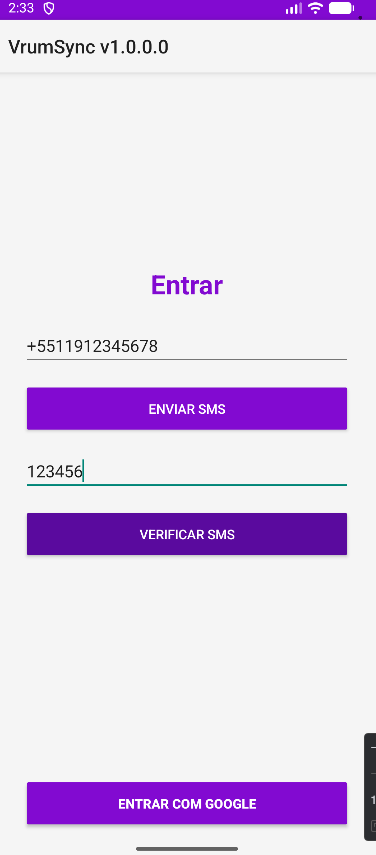
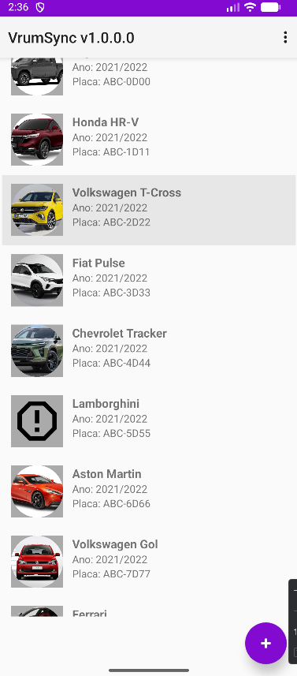
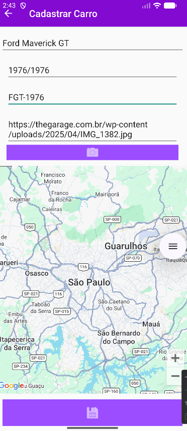

Esse é o readme no git    # 🚗 VrumSync


Aplicativo Android desenvolvido para gerenciamento de veículos, com autenticação, consumo de API, persistência local e integração com mapas.

> 📌 Projeto com foco em boas práticas de desenvolvimento Android e arquitetura organizada.

---

## ✨ Funcionalidades

* 🔐 Autenticação via SMS (Firebase) e Google
* 🚗 Listagem de veículos
* ➕ Cadastro de novos carros
* 📄 Visualização detalhada
* 🗺️ Localização do veículo via mapa
* 💾 Armazenamento local com Room
* 🌐 Integração com API REST (Retrofit)

---

## 🧱 Arquitetura

O projeto segue uma estrutura organizada por camadas:

```id="rc2vdp"
UI (Activities)
↓
Service (API)
↓
Model (Dados)
↓
Database (Room)
```

✔ Separação de responsabilidades
✔ Código mais limpo e escalável

---

## 🛠️ Tecnologias Utilizadas

* Kotlin
* Android SDK
* Retrofit
* Room Database
* Firebase Authentication
* Google Maps API
* RecyclerView
* ViewBinding

---

## 📸 Demonstração

### 🔐 Login



### 🚗 Lista de Veículos



### ➕ Cadastro de Carro



### 📄 Detalhes do Veículo


---

## ▶️ Como Executar

```id="2t9zn4"
git clone https://github.com/nardeliodev/FTPR-Car-Android.git
```

1. Abrir no Android Studio
2. Sincronizar o Gradle
3. Executar em emulador ou dispositivo

---

## ⚙️ Configuração do Firebase

Por segurança, o arquivo `google-services.json` não está incluído.

Para rodar o projeto:

1. Criar projeto no Firebase
2. Adicionar app Android
3. Baixar `google-services.json`
4. Colocar em:

```id="4q9lh1"
app/google-services.json
```

---

## 📈 Possíveis Melhorias

* 🔍 Filtro e busca de veículos
* ☁️ Sincronização em nuvem
* 📊 Dashboard com estatísticas
* 🧪 Testes automatizados

---

## 👨‍💻 Autor

**Nardélio Ferreira dos Santos**

---

## 📎 Projeto Acadêmico

Desenvolvido com objetivo educacional, aplicando conceitos de:

* Arquitetura de software
* Consumo de API
* Persistência local
* Integração com serviços externos

---

## ⭐ Destaque

Projeto com estrutura próxima de aplicações reais, utilizando:

✔ API + Banco local
✔ Autenticação
✔ Interface moderna
✔ Organização em camadas

---